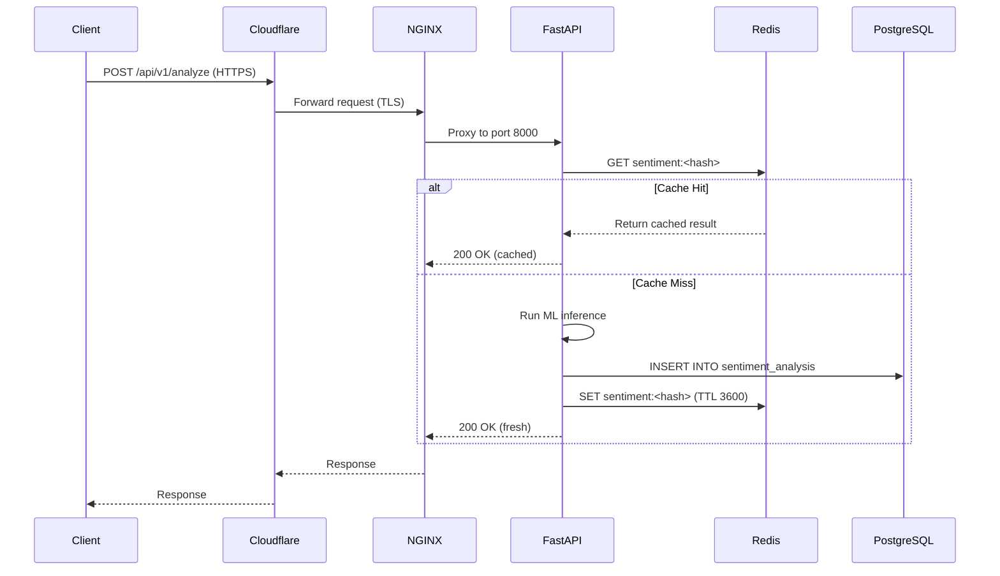
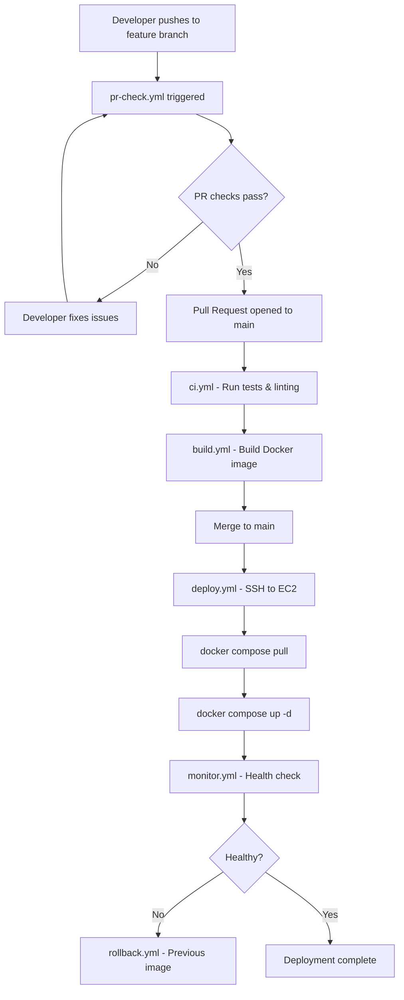

# System Architecture — AI Sentiment Analysis Platform

> **Repository:** https://github.com/abhi90-cloud/devops-assignment
> **Production URL:** https://ai-backend.astrodirectory.in
> **Monitoring URL:** https://monitoring.astrodirectory.in

---

## Table of Contents

1. [Overview](#overview)
2. [High-Level Architecture Diagram](#high-level-architecture-diagram)
3. [Detailed Component Architecture](#detailed-component-architecture)
4. [Request Flow](#request-flow)
5. [Data Flow Diagram](#data-flow-diagram)
6. [CI/CD Flow Diagram](#cicd-flow-diagram)
7. [Network Architecture](#network-architecture)
8. [Infrastructure Specifications](#infrastructure-specifications)
9. [Docker Architecture](#docker-architecture)
10. [Design Decisions](#design-decisions)
11. [High Availability Considerations](#high-availability-considerations)
12. [Future Improvements](#future-improvements)

---

## Overview

The AI Sentiment Analysis Platform is a cloud-native SaaS application that performs real-time natural language sentiment analysis via a REST API. It is deployed on AWS EC2 using a fully containerized Docker Compose stack, fronted by Cloudflare for DDoS protection and CDN caching, with NGINX handling SSL termination and reverse proxying, and a full observability stack comprising Prometheus, Grafana, and AlertManager.

The system is designed for high availability, security, and operational simplicity while maintaining production-grade reliability through automated CI/CD pipelines backed by GitHub Actions.

---

## High-Level Architecture Diagram

```
                         ┌─────────────────────────┐
                         │       END USER / CLIENT  │
                         │   Browser / API Consumer │
                         └────────────┬────────────┘
                                      │ HTTPS (443)
                                      ▼
                         ┌─────────────────────────┐
                         │        CLOUDFLARE        │
                         │  DDoS Protection / WAF   │
                         │  CDN / DNS / Rate Limit  │
                         └────────────┬────────────┘
                                      │ HTTPS (443) / HTTP (80)
                                      ▼
                         ┌─────────────────────────┐
                         │     NGINX (Container)    │
                         │  Reverse Proxy + SSL     │
                         │  Ports: 80, 443          │
                         └────────────┬────────────┘
                                      │ HTTP (8000) internal
                                      ▼
                         ┌─────────────────────────┐
                         │   FastAPI (Container)    │
                         │   Python 3.12 / Uvicorn  │
                         │   Port: 8000             │
                         └──────┬──────────┬────────┘
                                │          │
                    ┌───────────▼──┐   ┌───▼───────────┐
                    │  PostgreSQL  │   │     Redis      │
                    │  16 (5432)   │   │   7  (6379)    │
                    │  Persistence │   │   Cache/Queue  │
                    └──────────────┘   └───────────────┘

                    ┌─────────────────────────────────────┐
                    │         MONITORING STACK            │
                    │                                     │
                    │  Prometheus (9090) ──► Grafana (3000)│
                    │       │                             │
                    │       ▼                             │
                    │  AlertManager (9093)                │
                    └─────────────────────────────────────┘
```

---

## Detailed Component Architecture

### Cloudflare

**Purpose:** Acts as the global entry point for all traffic destined for the platform.

**Features:**
- Anycast DNS routing ensures users connect to the nearest Cloudflare PoP
- DDoS mitigation at layers 3, 4, and 7
- Web Application Firewall (WAF) with OWASP ruleset
- SSL/TLS termination at the edge (Flexible or Full Strict mode)
- Rate limiting rules to prevent API abuse
- Origin IP masking to prevent direct EC2 access

**Benefits:**
- Reduces latency via edge caching of static responses
- Absorbs volumetric attacks before they reach the origin server
- Provides automatic HTTPS for all subdomains
- Free SSL certificates managed by Cloudflare

---

### NGINX Reverse Proxy

**Purpose:** Acts as the ingress controller inside the EC2 host, routing requests from Cloudflare to the FastAPI application container.

**Responsibilities:**
- SSL/TLS termination using Let's Encrypt certificates
- HTTP-to-HTTPS redirect (port 80 → 443)
- Reverse proxy to FastAPI on port 8000 via Docker internal network
- Request buffering and connection keep-alive management
- Security headers injection (HSTS, X-Frame-Options, X-Content-Type-Options)
- Access logging for auditing

```nginx
server {
    listen 443 ssl;
    server_name ai-backend.astrodirectory.in;

    ssl_certificate     /etc/letsencrypt/live/ai-backend.astrodirectory.in/fullchain.pem;
    ssl_certificate_key /etc/letsencrypt/live/ai-backend.astrodirectory.in/privkey.pem;

    location / {
        proxy_pass         http://fastapi:8000;
        proxy_set_header   Host $host;
        proxy_set_header   X-Real-IP $remote_addr;
        proxy_set_header   X-Forwarded-For $proxy_add_x_forwarded_for;
        proxy_set_header   X-Forwarded-Proto $scheme;
    }
}
```

---

### FastAPI Application

**Purpose:** The core business logic layer responsible for sentiment analysis inference and API serving.

**Responsibilities:**
- Exposes RESTful API endpoints for sentiment analysis
- Validates and sanitizes all incoming request payloads using Pydantic models
- Reads/writes sentiment results to PostgreSQL
- Uses Redis for caching repeated analysis requests (cache-aside pattern)
- Exposes `/health` and `/metrics` endpoints for monitoring
- Runs via Uvicorn ASGI server with multiple worker processes

**Key Endpoints:**

| Method | Endpoint | Description |
|--------|----------|-------------|
| POST | `/api/v1/analyze` | Submit text for sentiment analysis |
| GET | `/api/v1/results/{id}` | Retrieve analysis result by ID |
| GET | `/health` | Application health check |
| GET | `/metrics` | Prometheus metrics scrape target |

---

### PostgreSQL 16

**Purpose:** Primary persistence layer for all sentiment analysis records, user data, and audit logs.

**Responsibilities:**
- Stores all analysis requests with timestamps and results
- Maintains user authentication records
- Provides ACID-compliant transactional guarantees
- Exposes port 5432 only on the internal Docker network (not exposed to host)

**Data Model (simplified):**

```sql
CREATE TABLE sentiment_analysis (
    id          UUID PRIMARY KEY DEFAULT gen_random_uuid(),
    input_text  TEXT NOT NULL,
    sentiment   VARCHAR(20) NOT NULL,  -- 'positive', 'negative', 'neutral'
    confidence  FLOAT NOT NULL,
    created_at  TIMESTAMPTZ DEFAULT now()
);
```

---

### Redis 7

**Purpose:** High-performance in-memory cache to reduce redundant ML inference calls and improve API response latency.

**Responsibilities:**
- Cache-aside pattern: check Redis before hitting the ML model
- TTL-based cache expiry (configurable, default 1 hour)
- Session storage for authenticated users
- Rate limiting counters (sliding window algorithm)
- Pub/Sub for async task notifications

**Cache Key Strategy:**
```
sentiment:v1:<sha256(input_text)>  →  {sentiment, confidence, cached_at}
```

---

### Prometheus

**Purpose:** Time-series metrics collection and storage.

**Scrape Targets:**

| Target | Port | Path |
|--------|------|------|
| FastAPI app | 8000 | `/metrics` |
| NGINX | 9113 | `/metrics` |
| PostgreSQL exporter | 9187 | `/metrics` |
| Redis exporter | 9121 | `/metrics` |
| Node exporter (host) | 9100 | `/metrics` |

---

### Grafana

**Purpose:** Metrics visualization and dashboard platform.

**Dashboards provisioned:**
- Application Overview (RPS, latency, error rate)
- Infrastructure Overview (CPU, memory, disk, network)
- Database Performance (query times, connections, cache hit rate)
- Redis Performance (hit/miss ratio, memory usage, evictions)

Access: https://monitoring.astrodirectory.in (admin/admin)

---

### AlertManager

**Purpose:** Handles Prometheus alert routing, deduplication, grouping, and delivery.

**Alert channels configured:**
- Email notifications for critical alerts
- Slack webhook integration
- PagerDuty for on-call escalation (configurable)

---

## Request Flow

A step-by-step walkthrough of a typical sentiment analysis API call:

```
1. Client sends POST /api/v1/analyze with JSON payload
2. Request hits Cloudflare edge PoP — WAF rules evaluated
3. Cloudflare proxies to EC2 public IP on port 443
4. NGINX terminates SSL and forwards to fastapi:8000 over Docker bridge
5. FastAPI validates request body via Pydantic schema
6. FastAPI computes SHA-256 hash of input_text
7. Redis checked for cached result (cache hit → return immediately)
8. On cache miss: ML model performs inference
9. Result written to PostgreSQL with UUID and timestamp
10. Result stored in Redis with TTL
11. JSON response returned to client
12. NGINX logs access entry
13. Prometheus scrapes /metrics on next interval
```

---

## Data Flow Diagram



---

## CI/CD Flow Diagram



**Workflow Descriptions:**

| Workflow | Trigger | Purpose |
|----------|---------|---------|
| `ci.yml` | Push to any branch | Run unit tests, linting, type checks |
| `build.yml` | Push to main | Build and push Docker image to registry |
| `deploy.yml` | After build succeeds | SSH to EC2 and deploy new containers |
| `rollback.yml` | Manual dispatch | Revert to previous Docker image tag |
| `monitor.yml` | Post-deploy | Validate health checks after deployment |
| `pr-check.yml` | PR opened/updated | Lint, test, and validate PR before merge |

---

## Network Architecture

### Port Mapping Table

| Container | Internal Port | Host Port | Exposed Externally | Protocol |
|-----------|--------------|-----------|-------------------|----------|
| NGINX | 80 | 80 | Yes (via Cloudflare) | HTTP |
| NGINX | 443 | 443 | Yes (via Cloudflare) | HTTPS |
| FastAPI | 8000 | — | No (internal only) | HTTP |
| PostgreSQL | 5432 | — | No (internal only) | TCP |
| Redis | 6379 | — | No (internal only) | TCP |
| Prometheus | 9090 | 9090 | No (firewall blocked) | HTTP |
| Grafana | 3000 | 3000 | Yes (via NGINX proxy) | HTTP |
| AlertManager | 9093 | 9093 | No (internal only) | HTTP |

### Docker Network Topology

```
Docker Bridge Network: app_network
├── nginx            (nginx:latest)
├── fastapi          (custom image)
├── postgres         (postgres:16)
├── redis            (redis:7)
├── prometheus       (prom/prometheus)
├── grafana          (grafana/grafana)
└── alertmanager     (prom/alertmanager)
```

All containers communicate via the `app_network` Docker bridge. No container except NGINX has host-exposed ports reachable from the internet.

---

## Infrastructure Specifications

| Attribute | Value |
|-----------|-------|
| Cloud Provider | AWS |
| Instance Type | EC2 t2.medium |
| vCPUs | 2 |
| Memory | 4 GB RAM |
| Storage | 30 GB EBS gp2 |
| Operating System | Ubuntu 22.04 LTS |
| Kernel | 5.15+ |
| Docker Engine | 24.x |
| Docker Compose | v2.x |
| Region | (configured per deployment) |
| Elastic IP | Yes (static, assigned to instance) |
| DNS Provider | Cloudflare |
| SSL Provider | Let's Encrypt (via Certbot) |

---

## Docker Architecture

### Container Orchestration

Docker Compose v2 is used to define and manage all seven containers as a single application unit.

```yaml
# Simplified docker-compose.yml structure
services:
  nginx:        # Reverse proxy & SSL termination
  fastapi:      # Application layer
  postgres:     # Persistent data store
  redis:        # Cache layer
  prometheus:   # Metrics collection
  grafana:      # Metrics visualization
  alertmanager: # Alert routing
networks:
  app_network:
    driver: bridge
volumes:
  postgres_data:
  redis_data:
  prometheus_data:
  grafana_data:
```

### Named Volumes

| Volume | Container | Purpose |
|--------|-----------|---------|
| `postgres_data` | PostgreSQL | Database files persistence |
| `redis_data` | Redis | RDB snapshot persistence |
| `prometheus_data` | Prometheus | TSDB storage |
| `grafana_data` | Grafana | Dashboard and datasource configs |

### Restart Policy

All containers are configured with `restart: unless-stopped` to ensure automatic recovery after host reboots or container crashes.

---

## Design Decisions

### Why FastAPI?
FastAPI provides native async support (ASGI), automatic OpenAPI documentation, and Pydantic-based request validation — making it ideal for high-throughput ML inference APIs. Its performance benchmarks are comparable to Node.js and Go for I/O-bound workloads.

### Why Redis?
Redis provides sub-millisecond read/write latency for cache operations. The cache-aside pattern dramatically reduces repeated ML inference overhead — repeated identical queries are served from cache with ~1ms latency instead of 200–500ms model inference time.

### Why PostgreSQL?
PostgreSQL is the most capable open-source RDBMS available, with native JSON support, full ACID compliance, and excellent Python ecosystem support (SQLAlchemy, asyncpg). It handles the persistence requirements without introducing operational complexity.

### Why Cloudflare?
Cloudflare provides enterprise-grade DDoS protection, WAF, and global CDN for free or low cost. It also masks the origin server's IP, preventing direct-to-origin attacks from bypassing security controls.

### Why Docker Compose?
For a single-node deployment of this scope, Docker Compose provides the right balance of reproducibility, simplicity, and operational clarity. It allows the entire stack to be brought up or down with a single command while maintaining isolation between services.

---

## High Availability Considerations

The current architecture is a single-node deployment suitable for development and staging. For production at scale, the following improvements are recommended:

- **Database:** Migrate to Amazon RDS PostgreSQL with Multi-AZ standby for automatic failover
- **Cache:** Migrate to Amazon ElastiCache Redis with replication group
- **Application:** Move to ECS Fargate or Kubernetes (EKS) for horizontal auto-scaling
- **Load Balancing:** Add AWS ALB in front of multiple EC2 instances

---

## Future Improvements

- [ ] Migrate to Kubernetes (EKS) for container orchestration at scale
- [ ] Implement blue/green deployments via ALB weighted target groups
- [ ] Add distributed tracing with OpenTelemetry + Jaeger
- [ ] Introduce async task queues (Celery + SQS) for long-running inference jobs
- [ ] Add database connection pooling via PgBouncer
- [ ] Implement multi-region failover with Route 53 health checks

---

*DevOps Engineer Assignment — Deepak Sharma — June 2026*
